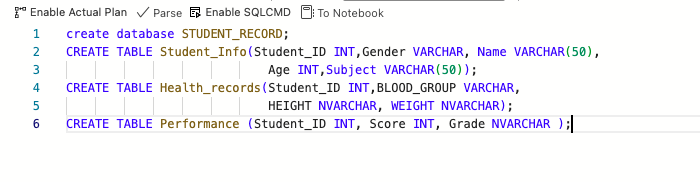
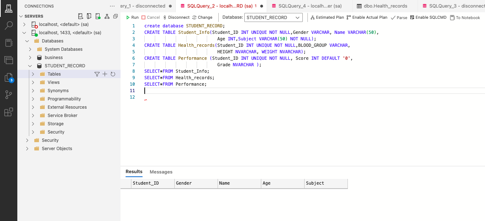
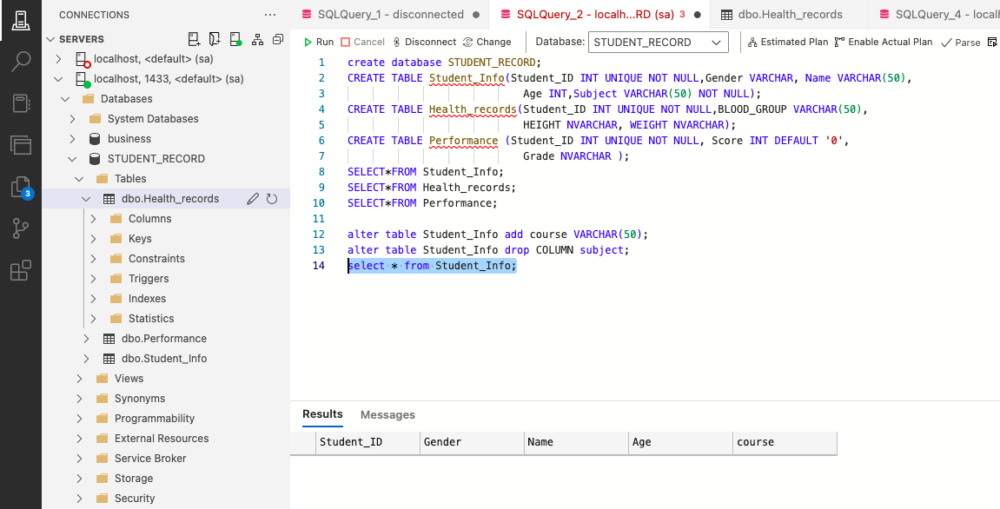
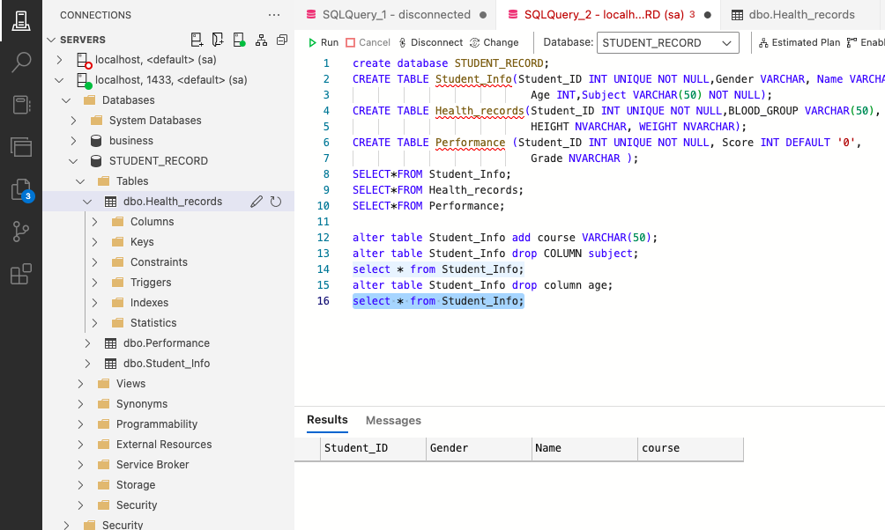
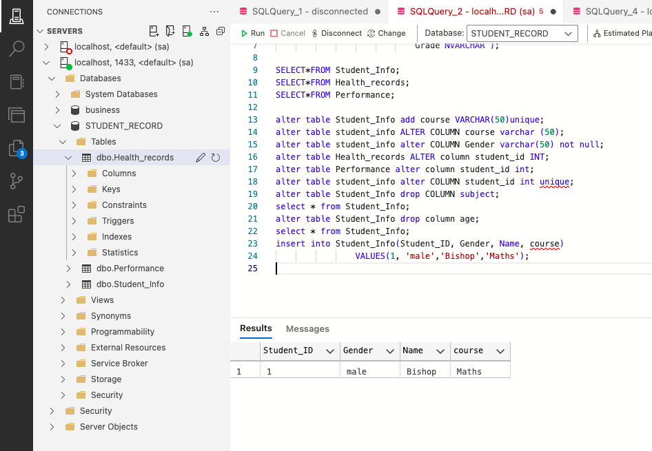
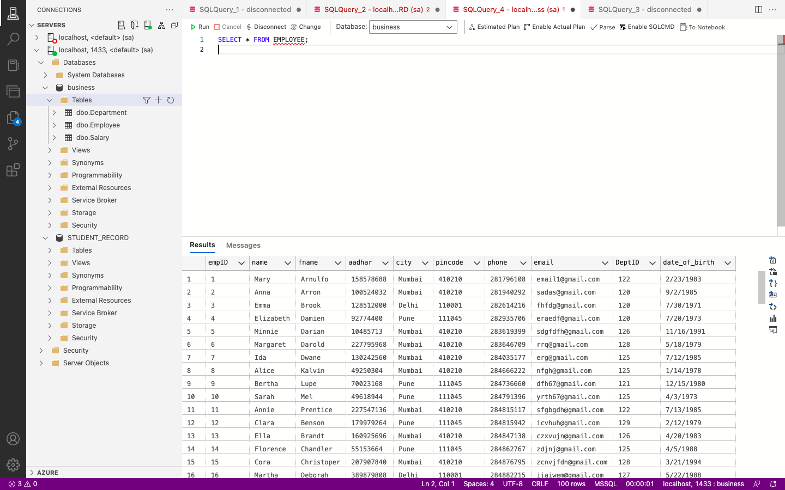
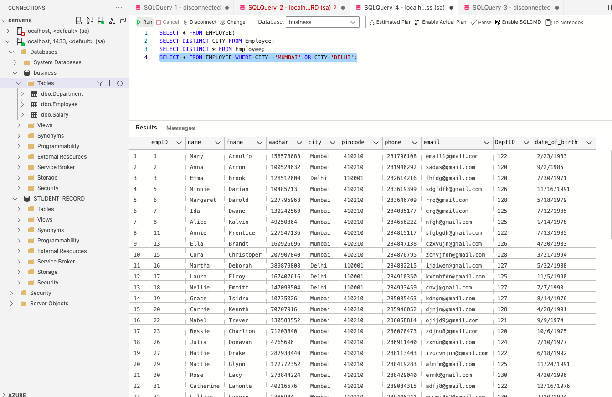
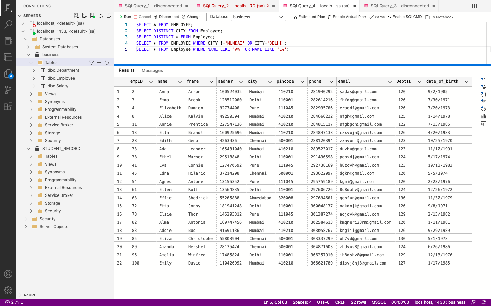
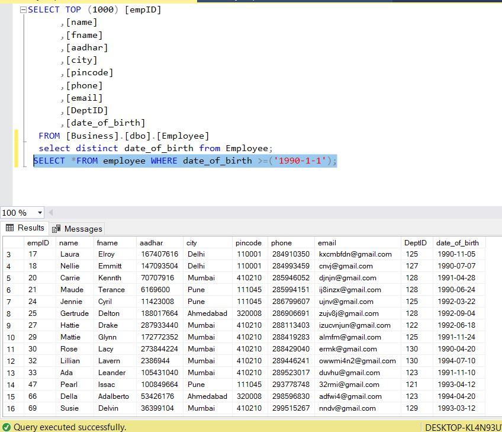

# SQL-101

## INTRODUCTION
This task was achieved using MSSQL studio installed in windows and Azule studio  for mac with MSSQL studio installed. This SQL project is divided into 3 task to solve the following

## TASK 1
- Create a Database named “Students Record”

Create the following tables in the database
- Students Info  (Student ID, Gender, Name, Age, Subject)
- Health records (Student ID, Blood Group, Height, Weight)
- Performance (Student ID, Score, Grade)
- The ID has to be unique
- Where a student has no score, it should be ‘0’ by default
- Add a constraint that prevents the ID and Subject from taking null values

Apply the following modifications to the table
- Change column name ‘’Subject” to ‘’Course” 
- Drop the “Age” column from the ‘Students Info’ table

## SOLUTION 
Database created named **STUDENT RECORD**

Students Info  (Student ID, Gender, Name, Age, Subject)

Health records (Student ID, Blood Group, Height, Weight)

Performance (Student ID, Score, Grade)

Change column name ‘’Subject” to ‘’Course” and " Age " column removed

## TASK 2
After importing the tables and placing in a new database called 'Business'
- Select the employee table and show the data where city is Mumbai and Delhi. 
- Select the employee table where employee first name have both ‘a’ and ‘e’  in them. 
- Subset the employee table to have employee with date of birth above 1990
- Subset the salary table to show salaries less than 1 million and sort in an ascending order

## SOLUTION 

The employee table

Employee data showing Mumbai and Delhi

Employee table where employee first name have both ‘a’ and ‘e’  in them.

Employee with date of birth above 1990

Salaries less than 1 million and sort in an ascending order

